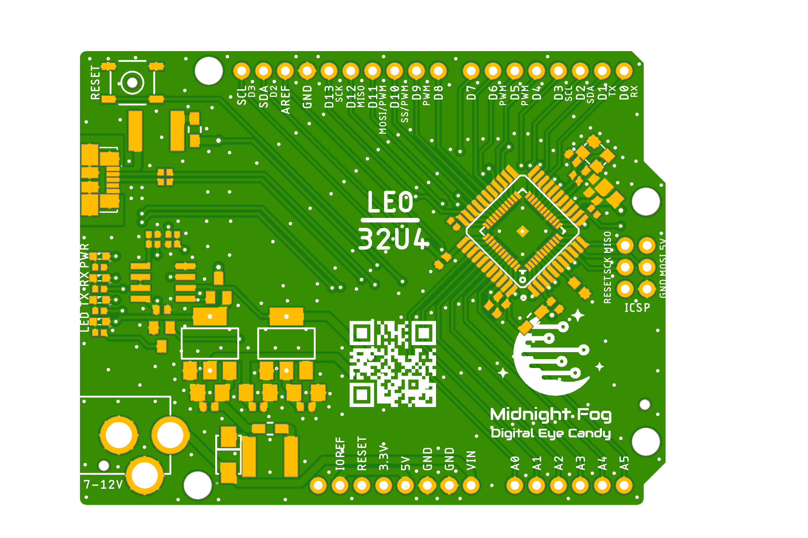

# LEO/32U4 project

LEO/32U4 is a clone board of popular Arduino Leonardo board.
Main goal of the project is to improve EMC property of original board keeping it still simple and cheap to produce.

## Leo_v1.0

**Leo_v1.0** is version 1.0 of the board based on ATMEGA32U4 MCU.

Preview:

[Schematics in PDF format](doc/Leo_v1.0.pdf)

Features:

- Leonardo compatible board pinout
- Leonardo compatible MCU ATMEGA32U4
- 2 layer board design
- alternative footprints for MCU: TQFP and VQFN
- modern microUSB connector
- possibly better EMC parameters (not yet tested)

CAM files are available.
BoM and PnP files for JLCPCB are available.

## How to help

Your contributions as code, resources, or finances are welcome! Please contact me directly via email at andriy.golovnya@gmail.com or through my [GitHub profile](https://github.com/red-scorp).

If you'd like to make a financial contribution, you can donate via [PayPal](http://paypal.me/redscorp) or [Ko-Fi](http://ko-fi.com/redscorp). Your support is greatly appreciated.

Thanks in advance!
